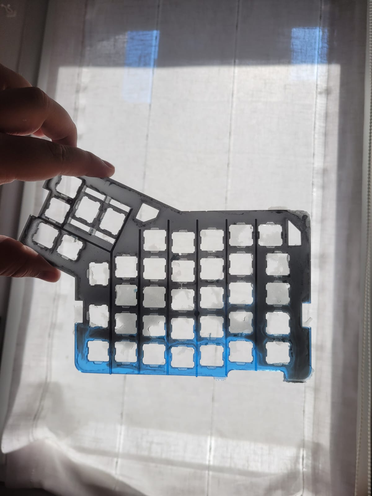
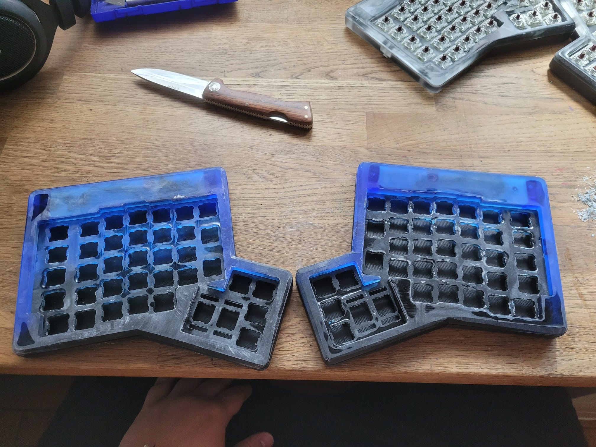

# 🛠️ Ergodox Custom Build – DIY Open-Source Mechanical Keyboard from Scratch

This project documents the complete, **from-scratch** creation of a fully custom **ErgoDox** mechanical keyboard, built using open-source tools and homemade fabrication techniques.

## ✨ What Makes This Project Special?

- 🔧 **Built entirely from scratch**: No pre-made kits were used—everything was sourced, designed, or assembled by hand.
- 🖨️ **3D-printed molds and components**: All molds for the case were designed and printed using a 3D printer. The case mold bases were printed in PLA with an FDM printer.
- 🎨 **Custom-designed, resin-printed keycaps**: Keycaps were printed using a **resin printer** with **mechanical-grade resin** for durability. The engraved symbols are painted **white from the inside** to make them stand out through the semi-transparent surface.
- 🐧 **Custom SUPER key**: Includes a special keycap featuring the **Linux penguin** for the SUPER key.
- 🧱 **Resin case with alcohol ink dyes**: The case was cast in resin using silicone molds and **tinted with alcohol-based dyes**, producing a cloud-like mix of black and blue tones.
- ⌨️ **Custom QMK firmware**: Powered by [QMK Firmware](https://qmk.fm/), fully programmable via the [ZSA Configurator](https://configure.zsa.io/ergodox-ez/layouts/6pvpn/latest/0).
- 🔌 **Coiled interconnect cable**: The cable between the two halves of the keyboard is coiled manually to keep the setup **clean and tidy**.
- ⛺ **Tent kit support**: This build includes a [tenting kit](https://www.zsa.io/tenting/) for ergonomic tilt and wrist comfort *(not visible in the photos yet, as it's pending black paint)*.

## 🧩 Project Components

- **PCB**: Based on the open-source [Ergodox design](https://www.ergodox.io/).
- **Microcontrollers**: Teensy USB Board, Version 2.0.
- **Custom keycaps**:
  - Printed in resin using **durable, mechanical-grade resin**.
  - Symbols painted internally for enhanced visibility.
  - Includes a **custom Linux SUPER keycap**.
- **Resin case**:
  - Mold bases printed in **PLA** using a filament (FDM) printer.
  - Silicone poured to create flexible negative molds.
  - Cast in resin with **alcohol inks** for aesthetic effects.
- **Mechanical switches**: Cherry MX Brown.
- **Tent kit**: For ergonomic positioning (not yet shown in photos).

## 📸 Gallery

A selection of photos documenting the final build:

### 🔥 Back View (highlighted)

These showcase the smoky, marbled finish of the resin in stunning black and blue:

<table>
  <tr>
    <td align="center">
       
      <em>Back 1</em>
    </td>
    <td align="center">
       
      <em>Back 2</em>
    </td>
  </tr>
</table>

### 💠 Middle and Top Views

Showcasing layout, coiled interconnect cable, and details of the case and keycaps:

<table>
  <tr>
    <td align="center">
       
      <em>Middle 1</em>
    </td>
    <td align="center">
       
      <em>Middle 2</em>
    </td>
  </tr>
  <tr>
    <td align="center">
       
      <em>Top 0</em>
    </td>
    <td align="center">
       
      <em>Top View 1</em>
    </td>
  </tr>
  <tr>
    <td align="center">
       
      <em>Top View 2</em>
    </td>
    <td></td>
  </tr>
</table>

## 🖨️ Keycaps on Printables

Keycaps can also be downloaded from my Printables profile:
🔗 [My Printables Designs](https://www.printables.com/model/1158797-keycaps-ergodox-compatible)

## 🧠 Keyboard Layout

This build uses a custom layout for the Ergodox EZ. You can view and customize it via the ZSA online configurator:
👉 [View Layout](https://configure.zsa.io/ergodox-ez/layouts/6pvpn/latest/0)

## 📃 License

This project is released under the **MIT License**. Case and keycap designs are available for personal use. For commercial use, please contact me.
